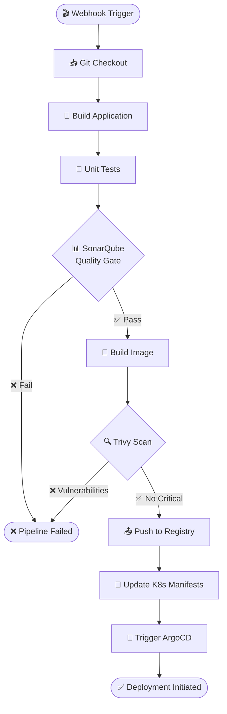

<div align="center">

# 🚀 MCA DevOps Test Solution

### *Modern Cloud-Native DevOps Pipeline with GitOps & Progressive Delivery*

[](https://opensource.org/licenses/MIT)
[](https://kubernetes.io/)
[](https://www.docker.com/)
[](https://www.jenkins.io/)
[](https://argo-cd.readthedocs.io/)

 &nbsp;&nbsp;
 &nbsp;&nbsp;


---

### 📊 **Complete DevOps Pipeline** | 🔒 **Security-First** | 🎯 **GitOps Native** | ⚡ **Progressive Delivery**

</div>


---

## 🎯 Overview

A **production-ready DevOps solution** demonstrating enterprise-grade practices for containerization, orchestration, continuous integration/deployment, and automated security scanning. This project implements a complete GitOps workflow using cutting-edge cloud-native tools.

---

## 🛠️ Tech Stack

<table>
<tr>
<td width="50%" valign="top">

### 🐳 Container & Orchestration

| Tool | Purpose | Version |
|------|---------|---------|
|  | **Containerization** | Latest |
|  | **Orchestration** | 1.32+ |
|  | **Package Manager** | 3.x |

</td>
<td width="50%" valign="top">

### 🔄 CI/CD & GitOps

| Tool | Purpose | Version |
|------|---------|---------|
|  | **CI Server** | LTS |
|  | **GitOps CD** | 2.x |
|  | **Progressive Delivery** | Latest |

</td>
</tr>
<tr>
<td colspan="2" valign="top">

### 🔒 Security & Quality

| Tool | Purpose | Key Features |
|------|---------|--------------|
|  | **Vulnerability Scanner** | CVE Detection, IaC Scanning, Secret Detection |
|  | **Code Quality** | Static Analysis, Security Hotspots, Code Coverage |

</td>
</tr>
</table>

---

## ✨ Features

<table>
<tr>
<td width="33%">

### 🎯 **GitOps Native**
- ✅ Infrastructure as Code
- ✅ Declarative configuration
- ✅ Git as single source of truth
- ✅ Automated sync & reconciliation

</td>
<td width="33%">

### 🔒 **Security First**
- ✅ Container vulnerability scanning
- ✅ Code quality gates
- ✅ Secret management
- ✅ Policy enforcement

</td>
<td width="33%">

### 🚀 **Progressive Delivery**
- ✅ Canary deployments
- ✅ Blue-green deployments
- ✅ Automated rollbacks
- ✅ Traffic splitting

</td>
</tr>
</table>

---

## 📋 Prerequisites

> 💡 **Pro Tip:** Use a package manager like `brew` (macOS), `apt` (Ubuntu), or `choco` (Windows) for easier installation!

### 🔧 Required Tools

<details open>
<summary><b>Click to expand installation commands</b></summary>

```bash
# 🐳 Docker
# Visit: https://docs.docker.com/get-docker/
docker --version

# ☸️ Kubectl
# macOS
brew install kubectl
# Linux
curl -LO "https://dl.k8s.io/release/$(curl -L -s https://dl.k8s.io/release/stable.txt)/bin/linux/amd64/kubectl"

# ⎈ Helm
curl https://raw.githubusercontent.com/helm/helm/main/scripts/get-helm-3 | bash

# 🔍 Trivy
# macOS
brew install trivy
# Linux
wget -qO - https://aquasecurity.github.io/trivy-repo/deb/public.key | sudo apt-key add -
echo "deb https://aquasecurity.github.io/trivy-repo/deb $(lsb_release -sc) main" | sudo tee -a /etc/apt/sources.list.d/trivy.list
sudo apt-get update && sudo apt-get install trivy

# 🎯 ArgoCD CLI
brew install argocd
# Or download from: https://github.com/argoproj/argo-cd/releases
```

</details>

### 📦 Infrastructure Requirements

| Component | Requirement | Notes |
|-----------|-------------|-------|
| **Kubernetes Cluster** | v1.32+ | Minikube, Kind, EKS, GKE, AKS |
| **Jenkins** | LTS version | With Docker & Kubernetes plugins |
| **Container Registry** | Any | Docker Hub, ECR, GCR, Harbor |
| **Git Repository** | Public/Private | GitHub, GitLab, Bitbucket |

---

## 🚀 Quick Start

### 1️⃣ Clone & Setup

```bash
# Clone the repository
git clone <repository-url>
cd mca-devops-test

# Verify all prerequisites
./scripts/verify-prerequisites.sh
```

### 2️⃣ Deploy Infrastructure

```bash
# Create namespaces
kubectl create namespace argocd
kubectl create namespace argo-rollouts
kubectl create namespace app

# Install ArgoCD
kubectl apply -n argocd -f https://raw.githubusercontent.com/argoproj/argo-cd/stable/manifests/install.yaml

# Install Argo Rollouts
kubectl apply -n argo-rollouts -f https://github.com/argoproj/argo-rollouts/releases/latest/download/install.yaml

# Wait for pods to be ready
kubectl wait --for=condition=ready pod -l app.kubernetes.io/name=argocd-server -n argocd --timeout=300s
```

### 3️⃣ Access ArgoCD UI

```bash
# Get initial admin password
kubectl -n argocd get secret argocd-initial-admin-secret -o jsonpath="{.data.password}" | base64 -d

# Port forward to access UI
kubectl port-forward svc/argocd-server -n argocd 8080:443

# Open browser: https://localhost:8080
# Username: admin
# Password: <from previous command>
```

### 4️⃣ Deploy Application

```bash
# Apply ArgoCD application
kubectl apply -f argocd/application.yaml

# Watch deployment
kubectl get applications -n argocd -w
```

---

## 📁 Project Structure

```
📦 mca-devops-test
┣ 📂 docker/
┃ ┣ 📜 Dockerfile                 # Multi-stage Docker build
┃ ┗ 📜 .dockerignore             # Docker ignore patterns
┣ 📂 k8s/
┃ ┣ 📂 base/                     # Base Kubernetes manifests
┃ ┃ ┣ 📜 deployment.yaml
┃ ┃ ┣ 📜 service.yaml
┃ ┃ ┗ 📜 configmap.yaml
┃ ┗ 📂 overlays/                 # Environment-specific overlays
┃   ┣ 📂 dev/
┃   ┣ 📂 staging/
┃   ┗ 📂 prod/
┣ 📂 helm/
┃ ┗ 📂 app-chart/                # Helm chart for application
┃   ┣ 📜 Chart.yaml
┃   ┣ 📜 values.yaml
┃   ┗ 📂 templates/
┣ 📂 jenkins/
┃ ┣ 📜 Jenkinsfile               # Declarative pipeline
┃ ┗ 📂 pipelines/                # Additional pipeline scripts
┣ 📂 argocd/
┃ ┣ 📜 application.yaml          # ArgoCD application definition
┃ ┣ 📜 project.yaml              # ArgoCD project
┃ ┗ 📜 repo-secret.yaml          # Repository credentials
┣ 📂 rollouts/
┃ ┣ 📜 canary-rollout.yaml       # Canary strategy
┃ ┣ 📜 bluegreen-rollout.yaml    # Blue-green strategy
┃ ┗ 📜 analysis-template.yaml    # Automated analysis
┣ 📂 trivy/
┃ ┣ 📜 trivy-config.yaml         # Trivy configuration
┃ ┗ 📜 scan-policy.yaml          # Security policies
┣ 📂 sonarqube/
┃ ┣ 📜 sonar-project.properties  # SonarQube properties
┃ ┗ 📜 quality-gate.json         # Quality gate rules
┗ 📜 README.md                    # This file!
```

---

## 🔄 CI/CD Pipeline

### 🔨 Jenkins Pipeline Flow



### 📊 Pipeline Stages Breakdown

| Stage | Tool | Duration | Description |
|-------|------|----------|-------------|
| **1. Checkout** | Git | ~5s | Clone source code from repository |
| **2. Build** | Maven/Gradle | ~2m | Compile application and run tests |
| **3. SonarQube** | SonarQube | ~1m | Static code analysis & quality gates |
| **4. Docker Build** | Docker | ~3m | Create optimized container image |
| **5. Trivy Scan** | Trivy | ~30s | Scan for vulnerabilities & secrets |
| **6. Push Image** | Docker | ~1m | Push to container registry |
| **7. Update Manifests** | Git | ~10s | Update image tags in K8s manifests |
| **8. ArgoCD Sync** | ArgoCD | ~2m | Deploy to Kubernetes cluster |

### 🎯 Pipeline Configuration

<details>
<summary><b>View Jenkinsfile Example</b></summary>

```groovy
pipeline {
    agent {
        kubernetes {
            yaml '''
                apiVersion: v1
                kind: Pod
                spec:
                  containers:
                  - name: docker
                    image: docker:latest
                  - name: trivy
                    image: aquasec/trivy:latest
            '''
        }
    }
    
    stages {
        stage('Checkout') {
            steps {
                git branch: 'main', url: 'https://github.com/your-repo'
            }
        }
        
        stage('Build & Test') {
            steps {
                sh './gradlew clean build test'
            }
        }
        
        stage('SonarQube Analysis') {
            steps {
                withSonarQubeEnv('SonarQube') {
                    sh './gradlew sonarqube'
                }
            }
        }
        
        stage('Quality Gate') {
            steps {
                timeout(time: 5, unit: 'MINUTES') {
                    waitForQualityGate abortPipeline: true
                }
            }
        }
        
        stage('Docker Build') {
            steps {
                container('docker') {
                    sh 'docker build -t myapp:${BUILD_NUMBER} .'
                }
            }
        }
        
        stage('Trivy Scan') {
            steps {
                container('trivy') {
                    sh 'trivy image --severity HIGH,CRITICAL myapp:${BUILD_NUMBER}'
                }
            }
        }
    }
}
```

</details>

---

## 🔐 Security & Quality

### 🔍 Trivy Security Scanning

<table>
<tr>
<td width="50%">

#### 🎯 **Scan Capabilities**
- ✅ OS package vulnerabilities (CVE)
- ✅ Application dependencies
- ✅ IaC misconfigurations
- ✅ Secret detection
- ✅ License compliance

</td>
<td width="50%">

#### ⚙️ **Configuration**
```yaml
# trivy-config.yaml
severity: HIGH,CRITICAL
ignore-unfixed: true
format: json
output: trivy-report.json
```

</td>
</tr>
</table>

### 📊 SonarQube Code Quality

<table>
<tr>
<td width="50%">

#### 📈 **Quality Metrics**
| Metric | Threshold |
|--------|-----------|
| Code Coverage | > 80% |
| Duplications | < 3% |
| Maintainability | A Rating |
| Reliability | A Rating |
| Security | A Rating |

</td>
<td width="50%">

#### 🚦 **Quality Gates**
- ✅ No new bugs
- ✅ No new vulnerabilities
- ✅ No new code smells
- ✅ Coverage on new code > 80%
- ✅ Security hotspots reviewed

</td>
</tr>
</table>

---

## 🎨 Deployment Strategies

### 🚀 Argo Rollouts Strategies

<table>
<tr>
<td width="50%">

#### 🔵🟢 **Blue-Green Deployment**

```yaml
apiVersion: argoproj.io/v1alpha1
kind: Rollout
metadata:
  name: app-rollout
spec:
  strategy:
    blueGreen:
      activeService: app-active
      previewService: app-preview
      autoPromotionEnabled: false
      scaleDownDelaySeconds: 30
```

**Benefits:**
- ✅ Zero-downtime deployments
- ✅ Instant rollback capability
- ✅ Full traffic switch
- ✅ Easy testing in production

</td>
<td width="50%">

#### 🐤 **Canary Deployment**

```yaml
apiVersion: argoproj.io/v1alpha1
kind: Rollout
metadata:
  name: app-rollout
spec:
  strategy:
    canary:
      steps:
      - setWeight: 20
      - pause: {duration: 5m}
      - setWeight: 50
      - pause: {duration: 5m}
      - setWeight: 80
      - pause: {duration: 5m}
```

**Benefits:**
- ✅ Gradual traffic shifting
- ✅ Risk mitigation
- ✅ A/B testing capability
- ✅ Automated promotion

</td>
</tr>
</table>

### 📊 Automated Analysis

```yaml
apiVersion: argoproj.io/v1alpha1
kind: AnalysisTemplate
metadata:
  name: success-rate
spec:
  metrics:
  - name: success-rate
    interval: 5m
    successCondition: result >= 0.95
    provider:
      prometheus:
        address: http://prometheus:9090
        query: |
          sum(rate(http_requests_total{status=~"2.."}[5m]))
          /
          sum(rate(http_requests_total[5m]))
```

---

## 📊 Monitoring

### 🔭 Recommended Stack

<table>
<tr>
<td align="center" width="33%">

### 📈 Prometheus


**Metrics Collection**
- Time-series database
- Service discovery
- Alert manager
- PromQL queries

</td>
<td align="center" width="33%">

### 📊 Grafana


**Visualization**
- Custom dashboards
- Real-time monitoring
- Alerting rules
- Multi-source data

</td>
<td align="center" width="33%">

### 📝 ELK Stack


**Log Aggregation**
- Centralized logging
- Log parsing
- Search & analytics
- Kibana dashboards

</td>
</tr>
</table>

### 📋 Key Metrics to Monitor

```yaml
# Deployment Metrics
- deployment_success_rate
- deployment_duration
- rollback_count

# Application Metrics
- request_rate
- error_rate
- response_time_p95
- cpu_utilization
- memory_usage

# Security Metrics
- vulnerability_count
- quality_gate_status
- security_hotspots
```

---

## 🤝 Contributing

We love contributions! 🎉 Here's how you can help:

### 🌟 Ways to Contribute

<table>
<tr>
<td>

#### 🐛 Report Bugs
Found a bug? [Open an issue](../../issues)

</td>
<td>

#### 💡 Suggest Features
Have an idea? [Start a discussion](../../discussions)

</td>
<td>

#### 📝 Improve Docs
Documentation improvements are always welcome!

</td>
</tr>
</table>

### 🔄 Contribution Workflow

```bash
# 1. Fork the repository
# 2. Create your feature branch
git checkout -b feature/amazing-feature

# 3. Commit your changes
git commit -m '✨ Add some amazing feature'

# 4. Push to the branch
git push origin feature/amazing-feature

# 5. Open a Pull Request
```

### ✅ Commit Convention

We follow [Conventional Commits](https://www.conventionalcommits.org/):

```
✨ feat: Add new feature
🐛 fix: Fix bug
📝 docs: Update documentation
♻️ refactor: Refactor code
✅ test: Add tests
🔧 chore: Update configuration
```

---

## 📄 License

This project is licensed under the **MIT License** - see the [LICENSE](LICENSE) file for details.

```
MIT License - Feel free to use this project for learning and development!
```

---

## 🙏 Acknowledgments

<div align="center">

### 💙 Built with Love by MCA DevOps Team

**Special Thanks To:**

|  |  |  |  |
|:---:|:---:|:---:|:---:|
| The CNCF community | Docker community | Argo Project | Jenkins community |

### 🌟 Star this repo if you found it helpful!

</div>

---

<div align="center">

### 📞 Support & Contact

[](../../issues)
[](../../discussions)
[](./docs)

---

**⚠️ Important Note:** This is a test/demonstration project. For production use, please implement proper security hardening, resource limits, backup strategies, and follow your organization's compliance requirements.

---

Made with ❤️ and ☕ by DevOps Engineers

**Happy Deploying! 🚀**

</div>
